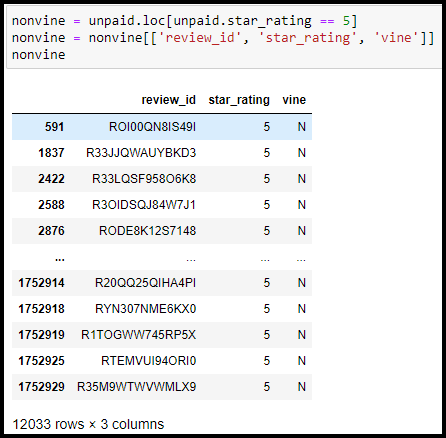

# Amazon_Vine_Analysis

## Project Overview
I've recently taken a job at BigMarket, a company that helps business optimize their marketing efforts, as their first data expert. One of their clients, SellBy, is about to release a catalogue of products on a retail website and want to know how their products compare to the reviews of similar products sold by their competitors. They are also considering implementing a program where they give free products to select reviewers, but first they want to know if it is worth the cost. Amazon offers a similar program called the Vine program, where reviewers are given products in exchange for an honest review.

The purpose of this project is to analyze review information from Amazon product categories, in this case Baby Products, and pull out the number of Vine and non-Vine reviews, find how many 5 star reviews were provided for each group and then to get the percentage of the 5 star reviews for Vine and non-Vine reviews to their respective total reviews.

## Resources
- Data Source: [Amazon Reviews](https://s3.amazonaws.com/amazon-reviews-pds/tsv/amazon_reviews_us_Baby_v1_00.tsv.gz), vine_table.csv
- Software: Python 3.7.6, Jupyter Notebook, Google Colab, Pandas, PySpark, PostgreSQL 14.6, pgAdmin4 6.18, Atom 1.63.1, Visual Studio Code 1.74.1

## Results

#### Vine Reviews

- How many Vine reviews were there?
  - There were 463 Vine reviews.

- How many Vine reviews were 5 stars?
  - There were 202 Vine reviews with 5 stars.

- What percentage of Vine reviews were 5 stars?
  - The percentage of Vine reviews with 5 stars is 43.64%

#### NonVine Reviews

- How many non-Vine reviews were 5 stars?
  - There were 25,094 non-Vine reviews.

- What percentage of Vine reviews were 5 stars?
  - There were 12,033 non-Vine reviews with 5 stars.

- What percentage of non-Vine reviews were 5 stars?
  - The percentage of non-Vine reviews with 5 stars is 47.95%

## Summary

From this analysis the Vine program for baby products does not result in a positivity bias. This conclusion comes from the comparison of the 5 star review percentages for Vine and non-Vine reviews. The Vine program only had 43.63% and non-Vine had 47.95% of their reviews as a 5 star review. So people that were paid for their review were not more likely than people that were not paid to leave a review with 5 stars for the products. An additional analysis that we can preform is to find the percentage of total reviews overall versus the total 5 star reviews. If this percentage is also greater than the Vine program percentage this would be an indicator as well that the Vine program does not result in a positivity bias.
